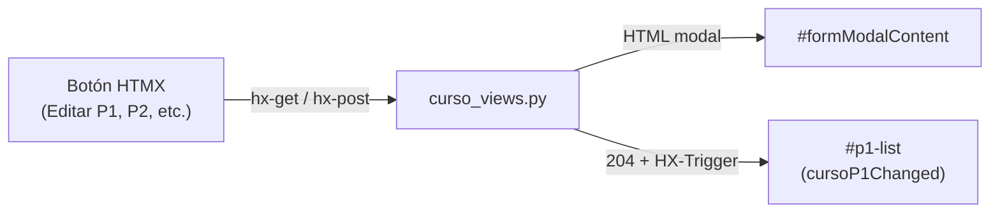

# Reparar botones de la vista P1/P2

## Diagnóstico

Vista afectada: pestaña **P1 / P2** en [`core/templates/core/cursos/detail.html`](../core/templates/core/cursos/detail.html), con acciones en [`core/templates/core/cursos/_p1_list.html`](../core/templates/core/cursos/_p1_list.html).



### Lo que ya funciona (verificado)

- URLs resuelven correctamente (`/evaluacion-p1/<pk>/editar/`, etc.)
- GET de editar/crear P1 y P2 devuelve **200** con HTML del modal
- POST válido devuelve **204** con header `HX-Trigger: cursoP1Changed`

### Problemas encontrados

**1. Modal Bootstrap mal gestionado (afecta TODOS los botones del modal)**

En [`core/templates/base.html`](../core/templates/base.html) se crea una instancia nueva en cada apertura:

```javascript
new bootstrap.Modal(document.getElementById('formModal')).show();
```

Esto puede dejar **backdrops duplicados** o el body con `modal-open`, bloqueando clics en toda la página. Es el patrón más probable cuando "ningún botón responde" después de abrir/cerrar un modal.

**2. Formulario P1 sin validación de materia duplicada (500 al guardar)**

`EvaluacionP1` tiene `unique_together = [("curso", "materia")]` en [`core/models.py`](../core/models.py), pero [`EvaluacionP1Form`](../core/forms.py) no valida duplicados. Al crear o editar cambiando a una materia ya usada, Django lanza `IntegrityError` → respuesta 500 → el modal parece "roto".

Reproducido con test client: POST duplicado en `/cursos/<id>/p1/crear/` → 500.

**3. Materia editable en edición (riesgo de error al guardar)**

En edición, el campo `materia` sigue habilitado aunque la relación curso+materia es única. Cambiar materia puede provocar el mismo 500. Lo correcto es **bloquear materia en edición** (como hace la regla de negocio "una P1 por materia").

**4. Queryset de materias incompleto para profesores**

En [`EvaluacionP1Form.__init__`](../core/forms.py), si el profesor no tiene asignada la materia del P1 existente, el select queda inválido y el guardado puede fallar silenciosamente en el modal.

**5. Acciones incompletas vs otras pestañas**

Comparando con [`_planificacion_list.html`](../core/templates/core/cursos/_planificacion_list.html):

- P1: solo editar, **sin eliminar**
- P2: solo crear/eliminar, **sin editar**

Si el usuario espera editar registros P2 o eliminar P1, esos botones "no existen" aún (no es HTMX roto, falta la funcionalidad).

---

## Plan de corrección

### A. Arreglar ciclo del modal (global, impacto alto)

Archivo: [`core/templates/base.html`](../core/templates/base.html)

- Reemplazar `new bootstrap.Modal(...)` por `bootstrap.Modal.getOrCreateInstance(...).show()`
- Al cerrar modal (evento `hidden.bs.modal`):
  - Limpiar `#formModalContent`
  - Eliminar backdrops huérfanos (`.modal-backdrop`)
  - Quitar `modal-open` y `padding-right` del `body`
- Mantener el toast en respuestas 204, pero asegurar que el cierre del modal no deje overlay bloqueando clics

### B. Endurecer formulario P1

Archivo: [`core/forms.py`](../core/forms.py) — clase `EvaluacionP1Form`

- Aceptar parámetro `curso` en `__init__`
- **Crear**: excluir materias que ya tienen P1 en ese curso
- **Editar**: deshabilitar campo `materia` (readonly/disabled + hidden input para POST)
- **Validar** en `clean()`: si se intenta duplicar curso+materia, error amigable en el formulario (no 500)
- Incluir siempre `instance.materia` en el queryset aunque no esté en las materias del profesor

Archivos: [`core/curso_views.py`](../core/curso_views.py) — pasar `curso=curso` al form en create/update

### C. Completar acciones faltantes en P1/P2 (paridad con planificación)

| Acción | Vista | Template | URL |
|--------|-------|----------|-----|
| Eliminar P1 | `evaluacion_p1_delete` | `p1_delete.html` | `evaluacion-p1/<pk>/eliminar/` |
| Editar P2 | `registro_p2_update` | reutilizar `p2_form.html` | `registro-p2/<pk>/editar/` |

- Registrar rutas en [`core/urls.py`](../core/urls.py)
- Añadir botones en [`core/templates/core/cursos/_p1_list.html`](../core/templates/core/cursos/_p1_list.html):
  - Eliminar P1 (junto a Editar P1)
  - Editar P2 (junto al botón eliminar de cada registro)

### D. Verificación manual

Tras los cambios, probar en `/cursos/<id>/?tab=p1p2`:

1. **Editar P1** → modal abre → guardar → modal cierra → lista se refresca
2. **Nueva P1** → solo materias disponibles en el select
3. **P2** → crear y editar registro
4. **Eliminar P2** y **Eliminar P1** → confirmación y refresh
5. Abrir/cerrar modal 3–4 veces seguidas → clics siguen respondiendo (sin backdrop bloqueado)

---

## Archivos principales

- [`core/templates/base.html`](../core/templates/base.html) — fix modal Bootstrap
- [`core/forms.py`](../core/forms.py) — validación y UX del form P1
- [`core/curso_views.py`](../core/curso_views.py) — pasar `curso` al form + vistas delete/edit P2
- [`core/urls.py`](../core/urls.py) — nuevas rutas
- [`core/templates/core/cursos/_p1_list.html`](../core/templates/core/cursos/_p1_list.html) — botones faltantes
- Nuevo: `core/templates/core/cursos/p1_delete.html` (confirmación, mismo patrón que `p2_delete.html`)

## Tareas

| ID | Tarea | Estado |
|----|-------|--------|
| `fix-modal-lifecycle` | Corregir modal Bootstrap en `base.html` | pendiente |
| `fix-p1-form` | Mejorar `EvaluacionP1Form` | pendiente |
| `add-p1-delete-p2-edit` | Vistas/URLs para eliminar P1 y editar P2 | pendiente |
| `wire-p1-list-buttons` | Botones en `_p1_list.html` | pendiente |
| `manual-verify-p1p2-tab` | Probar flujo completo | pendiente |

## Notas

- No hace falta cambiar la lógica HTMX de `#p1-list` (`cursoP1Changed from:body`); el trigger en 204 sí se procesa en HTMX 2.0.4.
- El problema más transversal es el modal en `base.html`; el bug de duplicado P1 explica fallos al **guardar**, no al abrir el modal.
