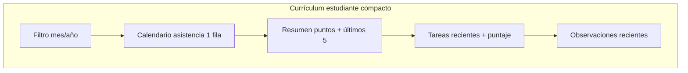
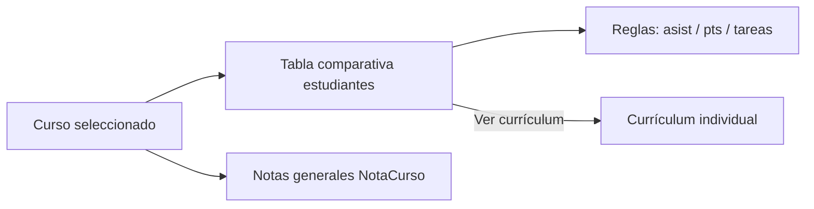

# Mejorar sistema de puntajes y currículums

Plan unificado: puntajes (participación + tareas), currículum del estudiante más compacto, y nueva vista **currículum por curso** para comparación entre estudiantes.

---

## Parte 1 — Sistema de puntajes (base)

### Participación (`core.models.Participacion`)

| Campo | Cambio |
|-------|--------|
| `tipo` | Se mantiene: `POSITIVO` / `NEGATIVO` |
| `valor` | **Nuevo** `PositiveSmallIntegerField` (1–5, default 1) |

- Formulario: dropdown **Tipo** + dropdown **Puntos** (1–5)
- Balance = `Sum(valor positivos) − Sum(valor negativos)`
- Migración: registros existentes → `valor=1`

### Tareas (`tareas.models`)

| Modelo | Campo | Detalle |
|--------|-------|---------|
| `Tarea` | `modalidad` | `ORAL` \| `ESCRITA` |
| `TareaEvaluacion` | `puntaje` | Nullable; oral 1–5, escrita 1–10 |

Se mantiene `estado`, `tardio` y `comentario_maestro` junto al puntaje.

---

## Parte 2 — Currículum del estudiante (UI compacta)

Vistas actuales: [`core/templates/core/estudiantes/curriculum.html`](../core/templates/core/estudiantes/curriculum.html) y [`accounts/templates/accounts/padre_curriculum.html`](../accounts/templates/accounts/padre_curriculum.html).

**Problema:** listas/tablas largas (asistencia día a día, historial completo de puntos) hacen que el currículum se extienda demasiado.

### A. Asistencia — vista calendario (como historial)

Imitar el estilo de [`core/templates/core/asistencia/historial_table.html`](../core/templates/core/asistencia/historial_table.html), adaptado a **un solo estudiante**:

```
┌─────────────────────────────────────────────────────────────┐
│  Asistencias — Marzo 2026                    P  A  T  E  %  │
├────┬────┬────┬────┬────┬ ... ─── días lectivos (L-V) ─── ... │
│  3 │ P  │ P  │ A  │ -  │ ...                              │
└────┴────┴────┴────┴────┴───────────────────────────────────┘
```

**Implementación:**
- Extraer helper reutilizable `_dias_lectivos_mes(mes, anio)` y `_asistencia_calendario_estudiante(estudiante, mes, anio)` en [`core/views.py`](../core/views.py) (o `core/asistencia_utils.py`)
- Nuevo partial: `core/templates/core/asistencia/_calendario_estudiante.html`
  - Una fila con badges `P/A/T/E/-` por día lectivo
  - Columnas resumen: presentes, ausentes, tardanzas, excusas, %
  - Leyenda compacta (reutilizar badges de historial)
- Reemplazar tabla Fecha/Estado en:
  - `curriculum.html` (profesor/staff)
  - `padre_curriculum.html` (padres)

**Beneficio:** ~20–23 celdas compactas vs. lista vertical de 20+ filas.

### B. Puntaje de participación — vista compacta

Con el nuevo sistema `valor` 1–5, rediseñar la sección de puntos en currículum:

**Encabezado (siempre visible):**
- Chips por materia: `Matemáticas +8 / −2 = +6` (suma de valores, no conteo)
- Total neto destacado

**Historial reciente (compacto):**
- Mostrar solo los **últimos 5–8** registros como filas tipo [`list_partial.html`](../core/templates/core/participaciones/list_partial.html) (`+4`, `-2`, materia, comentario truncado)
- Botón/enlace **«Ver historial completo»** → ficha del estudiante (pestaña participación)

**Eliminar:** tabla grande de historial completo en currículum (5 columnas × N filas).

### C. Tareas — vista compacta con puntaje

Actualizar sección «Tareas y evaluaciones»:

| Columna | Contenido |
|---------|-----------|
| Tarea | Título + badge **Oral** / **Escrita** |
| Entrega | Fecha |
| Estado | Completo / Pendiente / … |
| Puntaje | `4/5` o `8/10` según modalidad |
| Comentario | Truncado |

- Mostrar últimas **10** tareas; enlace «Ver todas» si hay más
- Promedio del mes visible en el encabezado de la sección (oral y escrita por separado si aplica)

### D. Observaciones

- Mantener lista actual pero con **límite de 5** visibles + «Ver más» hacia ficha del estudiante
- Evita scroll excesivo al final del currículum

### E. Layout general del currículum



**Archivos:**
- [`core/views.py`](../core/views.py) — `estudiante_curriculum`: helpers calendario, límites, agregaciones con `Sum('valor')`
- [`accounts/views.py`](../accounts/views.py) — `padre_estudiante_curriculum`: reutilizar partial asistencia
- [`core/templates/core/estudiantes/curriculum.html`](../core/templates/core/estudiantes/curriculum.html)
- [`accounts/templates/accounts/padre_curriculum.html`](../accounts/templates/accounts/padre_curriculum.html)
- Nuevo: `core/templates/core/asistencia/_calendario_estudiante.html`

---

## Parte 3 — Nueva vista: Currículum por curso

Vista para que el maestro compare el desempeño de **todos los estudiantes de un curso** en un solo lugar.

### URL y acceso

- Ruta: `cursos/<int:pk>/curriculum/` → `curso_curriculum`
- Enlace desde [`core/templates/core/cursos/detail.html`](../core/templates/core/cursos/detail.html) y/o [`list.html`](../core/templates/core/cursos/list.html)
- Permiso: `@school_access` (staff o profesor con materias del curso)

### Contenido de la vista

**Filtros:** mes, año, materia (opcional — limita puntos de participación a la materia del profesor)

**Tabla comparativa de estudiantes** (ordenable):

| Estudiante | Asist. % | Balance pts | Prom. tareas | Alertas | Acciones |
|------------|----------|-------------|--------------|---------|----------|
| García, Ana | 92% | +12 | Oral 4.2 · Escr. 7.5 | — | Ver currículum |
| Pérez, Luis | 68% | −3 | Oral 2.1 · Escr. 5.0 | ⚠ Baja asist. | Ver currículum · + Punto |

**Columnas detalladas:**
- **Asist. %** — del mes seleccionado (misma lógica que historial)
- **Balance pts** — suma neta participación (con nuevo `valor` 1–5); desglose +/- al hover o columna expandible
- **Prom. tareas** — promedio puntaje oral (1–5) y escrito (1–10) evaluadas en el periodo
- **Alertas** — reglas automáticas:
  - Asistencia < 75%
  - Balance participación negativo
  - Promedio tareas oral < 3 o escrita < 6
- **Acciones** — enlace a currículum individual; botón rápido «+ Punto» (modal participación existente)

**Panel lateral o sección inferior — Notas generales del curso:**
- Reutilizar [`NotaCurso`](../core/models.py) y partial [`_notas_list.html`](../core/templates/core/cursos/_notas_list.html)
- Botón «Nueva nota general» (modal HTMX ya existente en detalle curso)
- Comentarios generales visibles para seguimiento grupal

**Vista «a mejorar» (destacados):**
- Fila resaltada o badge para estudiantes con alertas
- Orden por defecto: peor balance / menor asistencia primero (priorizar intervención)

### Diagrama



### Archivos nuevos / modificados

| Archivo | Cambio |
|---------|--------|
| [`core/curso_views.py`](../core/curso_views.py) | Nueva vista `curso_curriculum` |
| [`core/urls.py`](../core/urls.py) | Ruta `curso_curriculum` |
| `core/templates/core/cursos/curriculum.html` | **Nuevo** — tabla comparativa + notas |
| [`core/templates/core/cursos/detail.html`](../core/templates/core/cursos/detail.html) | Enlace «Currículum del curso» |
| [`core/curso_utils.py`](../core/curso_utils.py) | Helpers agregación por curso (opcional) |

---

## Tareas de implementación (orden sugerido)

| ID | Tarea | Prioridad |
|----|-------|-----------|
| `participacion-valor-model` | Campo `valor` 1–5 + migración | Alta |
| `participacion-form-ui` | Dropdown puntos en formularios | Alta |
| `participacion-balance` | Balances con `Sum(valor)` | Alta |
| `tarea-modalidad-puntaje` | Modalidad oral/escrita + puntaje | Alta |
| `asistencia-calendario-partial` | Partial calendario reutilizable | Alta |
| `curriculum-estudiante-compact` | Rediseño currículum estudiante | Alta |
| `curriculum-padre-compact` | Mismo calendario en vista padres | Media |
| `curso-curriculum-view` | Vista comparativa por curso | Alta |
| `curso-curriculum-notas` | Integrar NotaCurso en vista curso | Media |
| `verify-all-curriculums` | Prueba flujos completos | Alta |

---

## Verificación manual

### Currículum estudiante
1. Asistencia del mes se ve en **una fila calendario** (no lista vertical)
2. Puntos muestran `+4`, `-2` y resumen por materia compacto
3. Historial de puntos limitado a ~5 items + enlace al detalle
4. Tareas muestran modalidad y puntaje (`4/5`, `8/10`)

### Currículum curso
1. Tabla con todos los estudiantes del curso y métricas del mes
2. Estudiantes con alertas destacados
3. Crear nota general del curso desde la vista
4. Enlace a currículum individual funciona
5. Profesor solo ve materias que le corresponden (si aplica filtro)

### Padres
1. Vista padre usa el mismo calendario de asistencia compacto

---

## Relación con otros planes

- **P1/P2 botones:** independiente ([`plan-fix-p1p2-buttons.md`](plan-fix-p1p2-buttons.md))
- Este documento **reemplaza y extiende** la versión anterior del plan de puntajes

## Decisiones de diseño

| Tema | Decisión |
|------|----------|
| Asistencia en currículum | Calendario 1 fila (estilo historial) |
| Historial puntos en currículum | Últimos 5–8 + enlace al detalle |
| Escala oral / escrita | 1–5 / 1–10 |
| Currículum curso | Tabla comparativa + NotaCurso + alertas |
| Orden por defecto curso | Estudiantes «a mejorar» primero |
